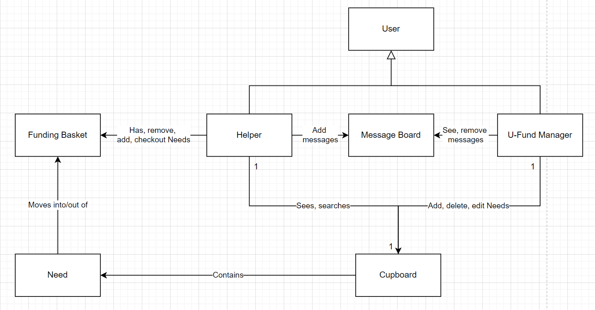
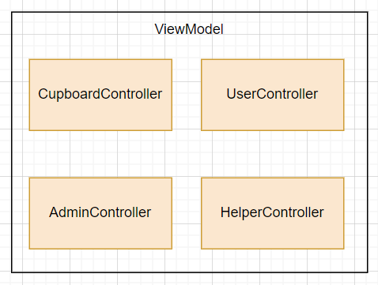
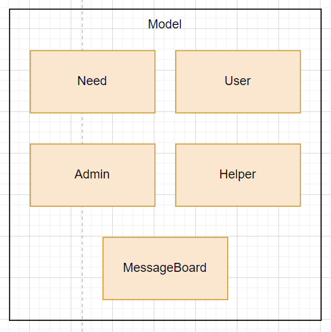
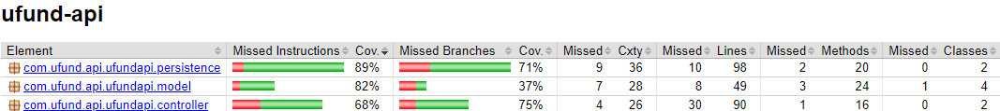
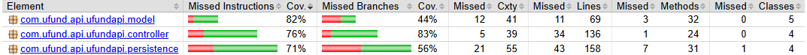
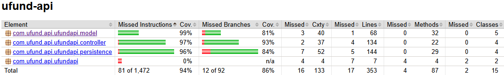

# PROJECT Design Documentation

## Team Information
* Team name: Platy Possibilities
* Team members
  * Daniel Baek
  * Javier Amaro
  * Kinkade Knox-Silva
  * Kaila Grant
  * Leo Mai

## Executive Summary

Platypossibilities is a web application focused around funding wilderness preservation. On the website, users are able to search through and choose various needs to give funding to, from ecosystem monitoring to restoration efforts. These needs can be created, changed, and removed by the admins so that any changes in those projects can be quickly reflected on the website and new projects can be brought to the attention of the users. Users are also able to message the admin to give them suggestions to improve the application.

### Purpose
>  _**[Sprint 2 & 4]** Provide a very brief statement about the project and the most
> important user group and user goals._

The project focuses on developing an Angular web application that manages the needs of a wilderness preservation organization. The most important user group of the project are the environmentalists, conservationists, and volunteers dedicated to preserving wilderness areas, while the most important user goals are to monitor ecosystems, track endangered species, and promote conservation efforts to safeguard natural habitats for future generations.

### Glossary and Acronyms
> _**[Sprint 2 & 4]** Provide a table of terms and acronyms._

| Term | Definition |
|------|------------|
| SPA | Single Page |

## Requirements

This section describes the features of the application.

> _In this section you do not need to be exhaustive and list every
> story.  Focus on top-level features from the Vision document and
> maybe Epics and critical Stories._

### Definition of MVP
> _**[Sprint 2 & 4]** Provide a simple description of the Minimum Viable Product._

The Minimum Viable Product involves a basic login system, in which a user only needs to put in a username to log in. If the username inputted is "admin," the user will log in as the U-Fund Manager. Otherwise, they will be a helper. They can also log out of the application. A helper can search for a need in the cupboard, as well as being able to add and remove needs from their funding basket. A U-Fund Manager can add, remove, and edit needs in the cupboard, but they do not have any access to a funding basket; this is something exclusive to helpers.

### MVP Features
>  _**[Sprint 4]** Provide a list of top-level Epics and/or Stories of the MVP._

### Enhancements

#### Message Board

There is a message board feature that allows any helper to send a message that can be read only by the admin. The admin is able to see any messages sent and can clear them from the message board.

#### Multi Select

When selecting needs, whether it be the helper choosing needs to add or remove from their basket or the admin choosing needs to delete, there is a feature to allow the selecting of multiple needs so the selected needs can be added, removed, or deleted with one button press.

## Application Domain

This section describes the application domain.

Everyone who signs into the application is a User. Most Users are Helpers who each have a Funding Basket where they can place the Needs that they want to fund and remove the ones that they do not. The Needs are stored in the Cupboard, where the Helpers can search for Needs they want and select Needs to move to their Basket. The other kind of User is the U-Fund Maneger, or Admin, who can create, modify, and remove Needs from the Cupboard. The Admin does not have a Funding Basket.

> _**[Sprint 2 & 4]** Provide a high-level overview of the domain for this application. You
> can discuss the more important domain entities and their relationship
> to each other._

## Architecture and Design

This section describes the application architecture.

### Summary

The following Tiers/Layers model shows a high-level view of the webapp's architecture. 
**NOTE**: detailed diagrams are required in later sections of this document.
> _**[Sprint 1]** (Augment this diagram with your **own** rendition and representations of sample system classes, placing them into the appropriate M/V/VM (orange rectangle) tier section. Focus on what is currently required to support **Sprint 1 - Demo requirements**. Make sure to describe your design choices in the corresponding _**Tier Section**_ and also in the _**OO Design Principles**_ section below.)_

The web application, is built using the Model–View–ViewModel (MVVM) architecture pattern. 

The Model stores the application data objects including any functionality to provide persistance. 

The View is the client-side SPA built with Angular utilizing HTML, CSS and TypeScript. The ViewModel provides RESTful APIs to the client (View) as well as any logic required to manipulate the data objects from the Model.

Both the ViewModel and Model are built using Java and Spring Framework. Details of the components within these tiers are supplied below.

### Overview of User Interface

This section describes the web interface flow; this is how the user views and interacts with the web application.

The user starts off on the login screen and, depending on which username they input, they will be routed to either the "helper" or "admin" page. Generally speaking, if the username is anything other than "admin," the user will be routed to the helper page; however, this will not work if the username is not already in the users.json, which only houses the usernames: johndoe, janedoe, and admin. 

If they input either johndoe or janedoe, they will be taken to the helper page, which shows their username at the top of the page, a router link to the basket page, a "need search" portion so the user can look for a specific Need, a list of the Needs, and an "add message" portion so that the helper can send a message to the admin about a certain issue that needs to be addressed. The user can click on the Needs to see overall details such as id, description, cost, quantity, and quantity funded. They can also either add Needs one by one into their funding baskets or select multiple to be added via the checkboxes next to each. They then would click the "add to basket" button to add the multiple selected Needs. Lastly, there is a logout button to be brought back to the login screen.

The basket page will show the individual Needs in the user's funding basket. If there are none, there will be a message stating this. If there are, it will list the Needs similarly to the helper page, in which the helper can either remove or select Needs to be removed from the basket or checked out respectively. 

The admin page will show the admin username up top, an input box to add a new Need to the cupboard, a list of all the Needs in the cupboard, and a message board of the messages the admin receives from the helpers. Here, the admin can choose to remove individual Needs via the remove button next to the Needs, or they can remove multiple via the checkboxes next to each as well as the "remove from cupboard" button. This works similarly with the message board, as the admin can remove messages that they've read. Lastly, a logout button is also available for the admin to be brought back to the login page.

### View Tier
> _**[Sprint 4]** Provide a summary of the View Tier UI of your architecture.
> Describe the types of components in the tier and describe their
> responsibilities.  This should be a narrative description, i.e. it has
> a flow or "story line" that the reader can follow._

> _**[Sprint 4]** You must  provide at least **2 sequence diagrams** as is relevant to a particular aspects 
> of the design that you are describing.  (**For example**, in a shopping experience application you might create a 
> sequence diagram of a customer searching for an item and adding to their cart.)
> As these can span multiple tiers, be sure to include an relevant HTTP requests from the client-side to the server-side 
> to help illustrate the end-to-end flow._

> _**[Sprint 4]** To adequately show your system, you will need to present the **class diagrams** where relevant in your design. Some additional tips:_
 >* _Class diagrams only apply to the **ViewModel** and **Model** Tier_
>* _A single class diagram of the entire system will not be effective. You may start with one, but will be need to break it down into smaller sections to account for requirements of each of the Tier static models below._
 >* _Correct labeling of relationships with proper notation for the relationship type, multiplicities, and navigation information will be important._
 >* _Include other details such as attributes and method signatures that you think are needed to support the level of detail in your discussion._

### ViewModel Tier

The classes supporting the ViewModel tier of the model would be the CupboardController public class, which houses the functions pertaining the needs, whether it be creating a need, deleting a need, get a need or needs, etc.

> _**[Sprint 4]** Provide a summary of this tier of your architecture. This
> section will follow the same instructions that are given for the View
> Tier above._

> _At appropriate places as part of this narrative provide **one** or more updated and **properly labeled**
> static models (UML class diagrams) with some details such as associations (connections) between classes, and critical attributes and methods. (**Be sure** to revisit the Static **UML Review Sheet** to ensure your class diagrams are using correct format and syntax.)_
> 

### Model Tier

The class supporting the Model tier would be the Need, Admin, Helper, and User public classes. The Need class houses the ID, title, description, and total funding of the specific need, while defining the functions connected to that class. The Admin class extends the User class, housing only a username. The Helper class, which also extends the User class, houses a username as well as a funding basket, which is an array list. The User class only houses the username.

> _**[Sprint 2, 3 & 4]** Provide a summary of this tier of your architecture. This
> section will follow the same instructions that are given for the View
> Tier above._

The Need class details every responsibility directly correlated with a Need, whether it be getting the properties (id, title, description, total_funding) from the object or changing the title of a specific Need to another one by updating it. The Admin class specifically details the actions and methods only an Admin can operate, which entails adding, removing, and editing the Needs in the cupboard. The Helper class can either remove needs from the funding basket, add needs to the funding basket, or get the funding basket entirely. The User class acts as a generalized backbone for the Admin and Helper classes, housing a method that gets the username of the User.

> _At appropriate places as part of this narrative provide **one** or more updated and **properly labeled**
> static models (UML class diagrams) with some details such as associations (connections) between classes, and critical attributes and methods. (**Be sure** to revisit the Static **UML Review Sheet** to ensure your class diagrams are using correct format and syntax.)_
> 

## OO Design Principles

The initial OO Principles that the team has considered for this first Sprint are the Single Responsibility and Controller principles. For the Single Responsibility, we have each class assigned to a specific portion of the project, whether it be having a class for the Cupboard or for the Need itself. For the Controller principle, we are implementing a CupboardController that allows for the manipulation of the needs, whether it be deleting a need, getting a need, or updating a need.

> _**[Sprint 2, 3 & 4]** Will eventually address upto **4 key OO Principles** in your final design. Follow guidance in augmenting those completed in previous Sprints as indicated to you by instructor. Be sure to include any diagrams (or clearly refer to ones elsewhere in your Tier sections above) to support your claims._

Encapsulation, Inheritance, Abstraction, Polymorphism

Encapsulation: The MessageBoard class encapsulates the overall board and exposes the methods so that the Helper and Admin classes can use its methods.

Inheritance: The two different users, the helpers and admin, inherit from a more generalized user class.

Abstraction: The overall User class is abstract, as it serves as a base class for the Helper and Admin classes.

Polymorphism: The MessageBoard class, in a sense, showcases polymorphism, as it treats the Helper and Admin classes as User objects.

> _**[Sprint 3 & 4]** OO Design Principles should span across **all tiers.**_

## Static Code Analysis/Future Design Improvements
> _**[Sprint 4]** With the results from the Static Code Analysis exercise, 
> **Identify 3-4** areas within your code that have been flagged by the Static Code 
> Analysis Tool (SonarQube) and provide your analysis and recommendations.  
> Include any relevant screenshot(s) with each area._

> _**[Sprint 4]** Discuss **future** refactoring and other design improvements your team would explore if the team had additional time._

## Testing

### Acceptance Testing

#### Sprint 4

Out of a total of 19 user stories, all 19 have passed their acceptance criteria tests. There were initially a few bugs, such as a bug preventing the admin from changing certain fields of a need, but they have all been fixed.

### Unit Testing and Code Coverage

#### Sprint 2

One anomaly for this code coverage is that the CupboardController tests do not test for when the DAO may throw an IOException. This makes it appear that it is missing more coverage than it actually is.

#### Sprint 3

Many tests do not test for the situation where the DAO would throw an IOException, but considering they should behave in the same way in that scenario, it should be fine.

#### Sprint 4

There are no real anomolies with these tests, most situations are covered.

The strategy for unit testing was to look at each significant function and determine the different paths that the code could take, creating a test for each different output. By the end of the project we wanted each element to have around 80%-90% code coverage. That would mean that we would be covering the important functions while not necessitating unecessary tests such as tests for toString functions. In this regard we met our goal quite well.  

## Ongoing Rationale
>_**[Sprint 1, 2, 3 & 4]** Throughout the project, provide a time stamp **(yyyy/mm/dd): Sprint # and description** of any _**mayor**_ team decisions or design milestones/changes and corresponding justification._

2024/09/29 Sprint 1: The team worked on and implemented the functionality of the CupboardController, while also implementing the routine formatting for the code. 

2024/10/09 Sprint 2: The team decided that, for the helpers and admin, there would be a more generalized user class that the other two classes inherit from.

2024/11/06 Sprint 3: The team made a new class in the model, MessageBoard, so that the helper can access message board and add new messages.